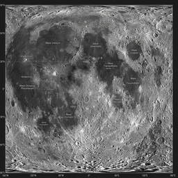

<div align="center">
  
  

  # 🌙 Miqaat (ميقَات)
  **Software that moves with the sky.**

  [](https://nextjs.org/)
  [](https://tailwindcss.com/)
  [](https://www.framer.com/motion/)
  [](https://www.typescriptlang.org/)
  
  <p align="center">
    A deeply atmospheric, premium Islamic dashboard designed to bring tranquility, mindfulness, and precise timings to your daily routine. 
  </p>
</div>

---

## 🌌 The Philosophy

In a world filled with digital noise and endless notifications, **Miqaat** is designed to be a sanctuary on your screen. The word *Miqaat* (ميقَات) refers to an appointed time or place. We built this application on a core philosophy: **"Software that moves with the sky."** 

Unlike static applications, Miqaat is a living, breathing environment. As the sun rises, travels across the sky, and sets into the quiet of the night, Miqaat’s entire aesthetic—the lighting, the ambient particles, the colors—shifts in real-time to match the celestial reality outside your window. It is not just an app; it is a digital companion that tethers you to the natural rhythms of the universe and your daily spiritual commitments.

## ✨ Signature Features

### 🌖 The Celestial Engine
Experience time visually. A photorealistic, 3D sun and moon actively track their true positions across a glowing arc on your screen. Built with custom CSS physics, you can physically interact with the celestial bodies—click and spin the fiery plasma of the sun or the textured craters of the moon with your mouse, and watch them smoothly carry momentum before settling back into their infinite, silent orbit. 

### 🕌 Precision Prayer & Qibla
Never miss a moment of connection.
* **Prayer Tracking:** Highly accurate, location-based prayer timings (Fajr, Dhuhr, Asr, Maghrib, Isha) with an elegant, un-intrusive countdown to your next prayer.
* **The Compass:** A beautiful, liquid-smooth Qibla compass that gracefully points you toward the Kaaba.

### 📖 Daily Reflection
Nourish your soul daily. We’ve meticulously curated a dataset of the most profoundly inspiring, universally regarded Hadiths and Quranic verses focusing on themes of patience, gratitude, mercy, and good character. A new reflection is seamlessly presented to you each day to set the tone for your morning.

### 🌤️ Weather & Moon Phases
Harmonize with your environment. Real-time local weather tracking and precise lunar phase calculations are elegantly integrated into the dashboard, ensuring you are always connected to the world around you.

### 💎 Premium Aesthetics
Every pixel is intentional.
* **Ambient Backgrounds:** Drift through soft dawn clouds, bask in a golden hour glow, and stargaze through twinkling night particles.
* **Spotlight Navigation:** A fluid, Framer Motion-powered dock that glows under your active tab like a soft streetlamp.
* **Glassmorphism:** Restrained, frosted-glass cards that let the beauty of the sky shine through.

---

## 🚀 Tech Stack

Miqaat is built at the intersection of modern web performance and fluid design:
- **Framework:** Next.js (App Router)
- **Styling:** Tailwind CSS + Radix UI Primitives
- **Animation:** Framer Motion (Complex SVG Paths, Layout Animations, Physics-based Dragging)
- **State Management:** Zustand (Global Time-of-Day Store)
- **Calculations:** `adhan.js` for precise astronomical prayer math
- **Icons:** Lucide React

## 🛠️ Getting Started

To run Miqaat locally and experience the living sky on your own machine:

```bash
# 1. Clone the repository
git clone https://github.com/rauf17/miqaat.git

# 2. Install dependencies
cd miqaat
npm install

# 3. Start the development server
npm run dev
```
Open [http://localhost:3000](http://localhost:3000) in your browser.

## 🤝 Contributing

We believe beautiful, spiritual tools should be built by the community. If you have an idea for a feature, an aesthetic improvement, or a translation, we welcome your pull requests. Let's build something beautiful together.

## 📜 License
This project is open-source and available under the [MIT License](LICENSE).

---
<div align="center">
  <p><i>"Indeed, in the creation of the heavens and the earth and the alternation of the night and the day are signs for those of understanding." (Quran 3:190)</i></p>
</div>
